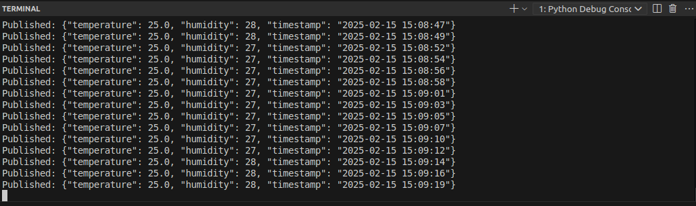

# Programming Assignment 1: Getting familiar with IoT devices
## Nate Pierce | UM - Dearborn | CIS 589

**Description**: In this assignment, you will develop a sensing application on a Raspberry Pi or another IoT device of your choice. Your task is to submit a concise, 2-page report (with screenshots) detailing your implementation and testing processes.

**Requirements**: Your sensing application should implement the following functionalities:
Read sensor data from a sensor attached to the Raspberry Pi.
Transmit the data to your computer using the MQTT protocol.

**Implementation**: My sensor of choice was a DHT11 Temperature & Humidity sensor. I was curious what the humidity is in my workspace during the dry winter months. 

I wrote some simple Python code to read the sensor data and create a payload to be sent out by the MQTT broker. The MQTT broker was set up and configured as outlined in the video.

The Raspberry Pi 5 was executing the Python code at 2 second intervals. Its payload included the temperature in celsius, the humidity (as a percentage) and a timestamp:

And was being received remotely on a device on the same LAN by listening in for messages from the raspberrypi.local host and relevant topic:

